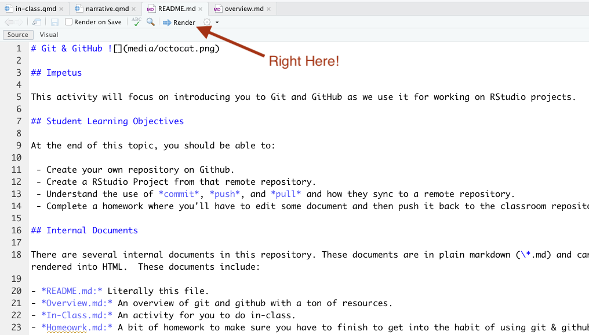

# Git & GitHub 

## Impetus

This activity will focus on introducing you to Git and GitHub as we use it for working on RStudio projects.

## Student Learning Objectives

At the end of this topic, you should be able to:  

 - Create your own repository on Github.  
 - Create a RStudio Project from that remote repository.
 - Understand the use of *commit*, *push*, and *pull* and how they sync to a remote repository.
 - Complete a homework where you'll have to edit some document and then push it back to the classroom repository.

## Internal Documents

There are several internal documents in this repository. These documents are in plain markdown (\*.md) and can be opened in RStudio and rendered into HTML.  These documents include:   

- *README.md:* Literally this file.  
- *narrative.md:* A general discussion this topic and what we will be doing.
- *overview.md:* An much more in-depth overview of Git and GitHub with a ton of resources.  
- *homework.md:* A bit of homework to make sure you have to finish to get into the habit of using git & github.

Open each of them up and take a look at the contents.  This is raw markdown.  I suspect that you'll be able to  get the overall idea of what is in the document since it is just text with a few extension.  To render it into HTML, hit the render button at the top of the window.

And it should make the document and show it in the *Viewer* pane (usually in the bottom right corner of your window).  Congratulations, you just 

## External Resources
 - [Slides](https://dyerlabteaching.github.io/Github-Classroom/slides.html#/title-slide) given for describing git and github.
 - A drawing of git operations based upon [cats](https://github.com/girliemac/a-picture-is-worth-a-1000-words/tree/main/git-purr) for more complicated operations.
 - A [Git Cheat Sheet](git-cheat-sheet-education.pdf) as PDF describing raw commands.

## Contact Information

If you need to contact me, I am available at:  
 - Email: rjdyer@vcu.edu
 - Twitter: [@dyerlab](https://twitter.com/dyerlab/)
