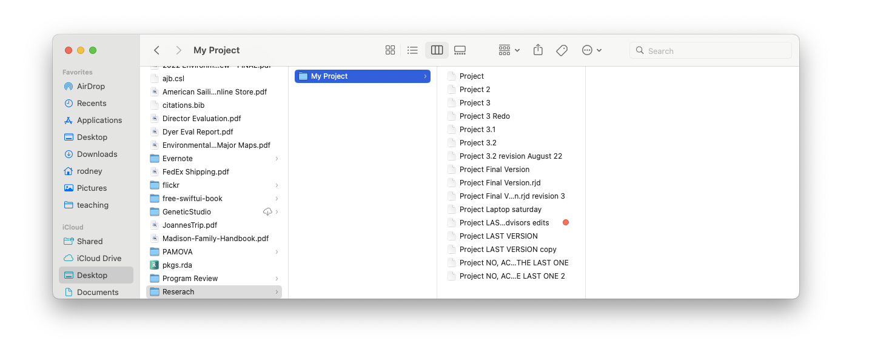
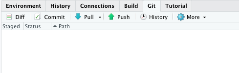
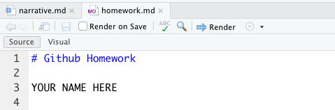
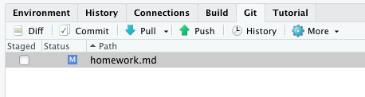
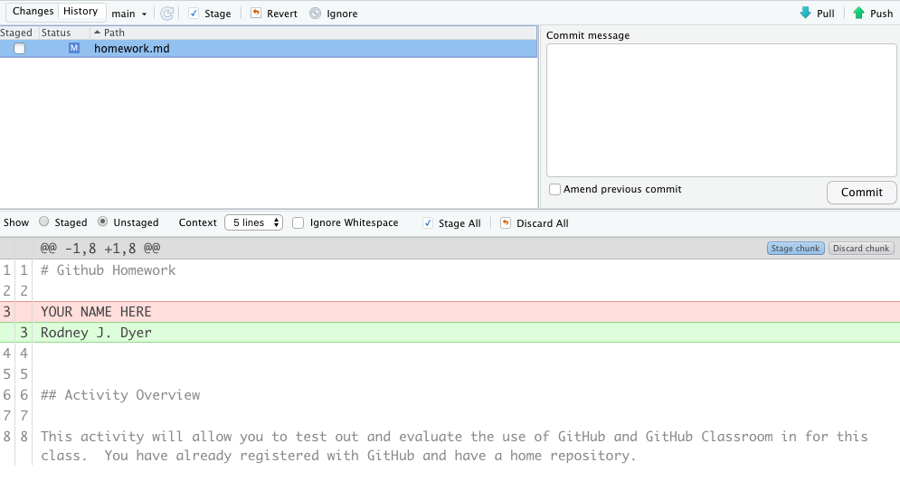

#  "Git & Github"

> Git is a tool for collaboration and to help you keep your stuff organized and reduce the amount of suckiness that is in your life. Seriously. It will allow you to keep distributed projects organized, facilitate easy collaborations, and protect your data and writings from becoming lost to time, vendor lock in, misplaced laptops, and all other maladies that plague scientists.

## Rationale

Sometimes a picture is worth a thousand words (or in this case at least a hundred file versions).  We must seek harmony in our lives that reduces complexity and associated unnecessary confusion and anxiety.  Doing things like the following, work only in opposition to these goals.

## Workflows

Ultimately, `git` is a program that lives on your computer.  It serves to allow you to initialize a repository—a database of all changes to your project if you will.

For our purposes, we will start initializing a repository on [GitHub](https://github.com) and then pull it down to our computer in [RStudio](https://rstudio.com).  

Git can be accessed through either the console (command line) or through buttons on the RStudio interface.  For our purposes, we will use RStudio first and then as you become more proficient, you can venture into the console (there is a command line console in RStudio next to the R console that is named `Terminal`).

If you look into the pane with the Environment Tabs, you will see that there is one named Git.  If you select this one (AND YOU HAVEN'T made any changes to your repository), it should look like this.

Now go open up the file `homework.md` and look at it.  It should look like this.

Now, when you edit this file, it will show up as changed in the Git panel.  Replace the `YOUR NAME HERE` part with your actual name and then save the file.  Notice in the Git Pane it now lists that file as changed.

This file is not *staged* (e.g., it is not set up to be commited yet).  If we select the file in the pane and hit the *Diff* button just above it, a Diff window shows us the actual changes that were made to that file.

So now, let's commit this file by staging it (click the box).  If you are doing this in the Git pane, then hit the commit button and it will pop up your Diff window.  At the top of the Diff window, you will see a box for a commit message.  This is an important message **to you** about what the changes you are making and how they impact the file.  It is *in your own best interested (e.g., so that future you does not hate present you), to put meaningful stuff into this message box.

So now you can push the changes (denoted by each Commit) back up to the GitHub Repository by pressing the *Push* button.  Once it is pushed up, you should be good.

## GitHub Classroom

The GitHub Classroom will allow the instructor to interact with you on your repositories.  Each homework assignment will be created there and you'll be sent a link.  You'll *Clone* the repository and then work on the content.  When you *Commit* and *Push* it back to GitHub Classroom, the instructor can then see and comment on it.  If additional changes need to be made, you'll have to *Pull* down those changes to update your local copy.

## Questions

If you have any questions for me specifically on this topic, please post as an Issue in your repository, otherwise consider posting to the discussion board on [Canvas](https://canvas.vcu.edu).  
